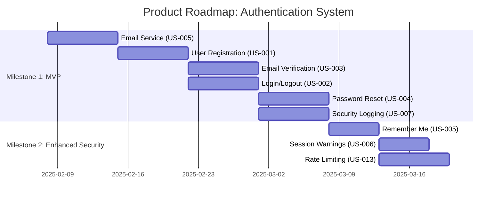

# Product Roadmap Planning

## Overview

Structured process for prioritizing features using frameworks (MoSCoW, RICE, Kano), creating milestone-based delivery plans, and breaking down work into sprint-sized increments with clear dependencies.

## Output Location

**Default Output Location:** Save all roadmaps to `~/Documents/claude-code-skills-data/product-roadmap-planning/` unless user specifies otherwise. Create the directory if needed.

---

## Workflow

### 1. Gather Inputs

- Requirements document (from requirements-gathering skill)
- User stories (from user-story-creation skill)
- Business priorities and success metrics
- Resource constraints (team size, timeline, budget)
- Technical dependencies and constraints

### 2. Apply Prioritization Framework

**Framework Selection:**
- **MoSCoW**: Simple categorization (Must/Should/Could/Won't)
- **RICE**: Quantitative scoring (Reach × Impact × Confidence / Effort)
- **Kano Model**: User satisfaction analysis (Basic/Performance/Delight)
- **Value vs Effort Matrix**: Visual 2×2 prioritization

**MoSCoW Prioritization:**

```
Must Have (Critical for MVP):
- Core functionality without which product cannot launch
- Legal/compliance requirements
- Critical user needs that define product value

Should Have (Important but not critical):
- Significant value but workarounds exist
- Enhances user experience meaningfully
- Adds competitive advantage

Could Have (Nice to have):
- Small improvements
- Incremental value
- Edge case handling

Won't Have (Out of scope for now):
- Low value relative to effort
- Not aligned with current strategy
- Postponed to future releases
```

**Example MoSCoW:**
```
Feature: User Authentication System

Must Have:
- Email/password registration (US-001)
- Login/logout functionality (US-002)
- Email verification (US-003)
- Password reset (US-004)

Should Have:
- Remember me checkbox (US-005)
- Session expiry warnings (US-006)
- Security audit logging (US-007)

Could Have:
- Social login (Google) (US-008)
- Biometric authentication (US-009)

Won't Have (this release):
- Single sign-on (SSO) (US-010)
- Multi-factor authentication (US-011)
```

**RICE Scoring:**

```
RICE = (Reach × Impact × Confidence) / Effort

Reach: How many users affected per time period (0-10)
Impact: How much it improves user experience (0.25=minimal, 0.5=low, 1=medium, 2=high, 3=massive)
Confidence: How certain are we about estimates (0-100%)
Effort: Person-months of work (0.5, 1, 2, 3, etc.)

Example:
Feature: Email verification
- Reach: 8 (1000 users/month)
- Impact: 2 (high - prevents spam)
- Confidence: 90%
- Effort: 0.25 person-months
- RICE = (8 × 2 × 0.9) / 0.25 = 57.6

Feature: Social login
- Reach: 5 (500 users/month)
- Impact: 1 (medium - convenience)
- Confidence: 70%
- Effort: 0.5 person-months
- RICE = (5 × 1 × 0.7) / 0.5 = 7.0

Prioritize by RICE score: Email verification (57.6) > Social login (7.0)
```

**Value vs Effort Matrix:**

```
High Value, Low Effort (Quick Wins - Do First):
- US-005: Remember me checkbox
- US-012: Password strength meter

High Value, High Effort (Major Projects - Plan Carefully):
- US-001: User registration system
- US-002: Authentication flow

Low Value, Low Effort (Fill-Ins - Do When Spare Time):
- US-015: Custom error messages

Low Value, High Effort (Avoid - Deprioritize):
- US-010: Single sign-on (SSO)
```

---

### 3. Create Milestone Structure

**Milestone Definition:** A milestone is a significant checkpoint with deliverable user value.

```
Milestone 1: MVP (Minimum Viable Product)
Timeline: Weeks 1-4
Goal: Users can create accounts and login securely

Success Metrics:
- 90% successful registration rate
- < 2s average login time
- 0 critical security vulnerabilities

Features (Must Have only):
- US-001: User registration (5 points)
- US-002: Login/logout (3 points)
- US-003: Email verification (3 points)
- US-004: Password reset (5 points)
- US-007: Security audit logging (3 points)
Total: 19 story points

Milestone 2: Enhanced Security
Timeline: Weeks 5-6
Goal: Improve security and reduce support burden

Success Metrics:
- < 1% password reset support tickets
- Session security incidents = 0

Features (Should Have):
- US-005: Remember me feature (2 points)
- US-006: Session expiry warnings (3 points)
- US-013: Rate limiting (5 points)
Total: 10 story points
```

---

### 4. Map Dependencies

**Dependency Types:**
- **Technical**: Feature B requires Feature A's code
- **Sequential**: Feature B logically follows Feature A in user flow
- **Data**: Feature B needs data from Feature A
- **Resource**: Same person working on both features

**Dependency Visualization:**

```
Critical Path (Must complete in order):
US-005 (Email Service) → US-001 (Registration) → US-003 (Email Verification)
                                ↓
                         US-002 (Login/Logout) → US-006 (Session Management)
                                ↓
                         US-004 (Password Reset)

Parallel Tracks (Can work simultaneously):
Track 1: US-001, US-003 (Frontend Developer A)
Track 2: US-007 (Security logging) (Backend Developer B)
Track 3: US-013 (Rate limiting) (Backend Developer C)
```

**Dependency Matrix:**

| Story | Depends On | Blocks |
|-------|-----------|--------|
| US-001 | US-005 | US-002, US-003, US-004 |
| US-002 | US-001 | US-006 |
| US-003 | US-001, US-005 | - |
| US-004 | US-001, US-005 | - |
| US-005 | - | US-001 |
| US-006 | US-002 | - |

---

### 5. Calculate Resource Requirements

**Team Velocity:**
- Average story points completed per sprint (2 weeks)
- Calculate from historical data or estimate conservatively

```
Team Composition:
- 2 Backend Developers
- 1 Frontend Developer
- 1 QA Engineer

Historical Velocity:
- Sprint 1: 22 points
- Sprint 2: 24 points
- Sprint 3: 20 points
- Average: 22 points per sprint

Conservative Estimate:
- Use 80% of average = 17-18 points per sprint
- Factor in learning curve, technical unknowns, meetings
```

**Resource Allocation Example:**

```
Milestone 1 (19 points):
- Sprint 1: 17 points
  - Backend: US-005 (Email Service) - 8 points
  - Backend: US-001 (Registration backend) - 5 points
  - Frontend: US-001 (Registration UI) - included
  - QA: Test plan creation - no points

- Sprint 2: 17 points
  - Backend: US-002 (Login backend) - 3 points
  - Backend: US-003 (Email verification) - 3 points
  - Backend: US-004 (Password reset) - 5 points
  - Backend: US-007 (Security logging) - 3 points
  - Frontend: US-002, US-004 (Login/reset UI) - included
  - QA: Test execution - 3 points

Total: 2 sprints (4 weeks)
```

---

### 6. Create Sprint Breakdown

**Sprint Planning Template:**

```
Sprint 1: February 08 - February 21, 2025
Theme: Foundation - User Registration

Capacity: 17 story points

Stories:
[ ] US-005: Email Service Integration (8 points)
    Assignee: Backend Developer B
    Dependencies: None
    Tasks:
      - Setup SendGrid account and API keys
      - Create email templates (verification, password reset)
      - Implement email sending service
      - Add retry logic and error handling
      - Write unit tests
    Acceptance Criteria:
      - Emails sent successfully with <60s delivery
      - Failed sends logged and retried
      - Email templates render correctly

[ ] US-001: User Registration (5 points)
    Assignee: Backend Developer A (backend), Frontend Developer (UI)
    Dependencies: US-005
    Tasks:
      - Database schema (users table)
      - Registration API endpoint
      - Password validation and hashing
      - Registration form UI
      - Form validation
      - Integration with email service
      - Unit and integration tests
    Acceptance Criteria:
      - Valid registrations create user accounts
      - Passwords hashed with bcrypt
      - Verification email sent
      - Error messages clear and helpful

Sprint Goal: Users can successfully create accounts with email verification

Definition of Done:
- Code peer reviewed
- Unit tests written (>80% coverage)
- Integration tests passing
- Manual QA completed
- Deployed to staging
- Product Owner sign-off

Risks:
- Email deliverability issues (Mitigation: Use established ESP)
- Integration delays (Mitigation: Start US-005 immediately)
```

---

### 7. Build Gantt Chart (Optional)

**Visual Roadmap using Mermaid:**



---

### 8. Generate Complete Roadmap Document

```markdown
# Product Roadmap: [Feature Name]

**Version:** 1.0
**Date:** 2025-02-08
**Author:** Product Architect
**Planning Horizon:** Q1 2025 (Weeks 1-8)

## Executive Summary

### Vision
[What you're building and why]

### Business Goals
- [Goal 1]
- [Goal 2]

### Success Metrics
- [Metric 1]: [Target]
- [Metric 2]: [Target]

## Prioritization Framework: MoSCoW

### Must Have (MVP - Milestone 1)
| ID | Feature | Story Points | Business Value | Risk |
|----|---------|--------------|----------------|------|
| US-001 | User Registration | 5 | Critical | Low |
| US-002 | Login/Logout | 3 | Critical | Low |
**Total:** 19 points

### Should Have (Milestone 2)
| ID | Feature | Story Points | Business Value | Risk |
|----|---------|--------------|----------------|------|
| US-005 | Remember Me | 2 | Medium | Low |
**Total:** 10 points

### Could Have (Milestone 3)
| ID | Feature | Story Points | Business Value | Risk |
|----|---------|--------------|----------------|------|
| US-008 | Social Login (Google) | 8 | Medium | High |
**Total:** 14 points

### Won't Have (Out of Scope)
- US-010: Single Sign-On (SSO) - Deferred to Q2
- US-011: Multi-Factor Authentication - Deferred to Q2

## Milestones

### Milestone 1: MVP (Weeks 1-4)
**Timeline:** February 08 - March 07, 2025
**Goal:** Users can create accounts and login securely

**Deliverables:**
- Functional user registration with email verification
- Secure login/logout with session management
- Self-service password reset
- Security audit logging

**Success Criteria:**
- [ ] 90% successful registration rate
- [ ] < 2s average login time (p95)
- [ ] 0 critical security vulnerabilities
- [ ] Product Owner sign-off

**Resource Allocation:**
- 2 Backend Developers (full-time)
- 1 Frontend Developer (full-time)
- 1 QA Engineer (full-time)

[Repeat for each milestone]

## Dependency Map

```
Critical Path:
Email Service Setup (US-005)
    ↓
User Registration (US-001)
    ↓
├─→ Email Verification (US-003)
├─→ Login/Logout (US-002)
│       ↓
│   Session Management (US-006)
│
└─→ Password Reset (US-004)

Parallel Work:
Security Logging (US-007) - can start anytime after US-002
Rate Limiting (US-013) - can start anytime after US-002
```

## Sprint Breakdown

### Sprint 1: February 08-21, 2025
**Theme:** Foundation - User Registration
**Capacity:** 17 story points

**Stories:**
1. US-005: Email Service Integration (8 points) - Backend Dev B
2. US-001: User Registration (5 points) - Backend Dev A + Frontend
3. US-012: Password Strength Meter (4 points) - Frontend

**Sprint Goal:** Users can successfully create accounts with email verification

**Risks:**
- Email deliverability issues
- Integration delays between backend and frontend

**Mitigation:**
- Start email service setup immediately
- Daily sync between backend and frontend devs

[Repeat for each sprint]

## Resource Plan

### Team Composition
- **Backend Developer A** (Senior): Core authentication logic
- **Backend Developer B** (Mid-level): Integrations and security
- **Frontend Developer** (Senior): Registration and login UI
- **QA Engineer** (Senior): Testing strategy and execution

### Timeline Summary
- **Total Duration:** 8 weeks (4 sprints)
- **Total Story Points:** 43 points
- **Average Velocity:** 10.75 points/week
- **Buffer:** 20% (built into conservative estimates)

## Risk Assessment

| Risk | Impact | Probability | Mitigation | Owner |
|------|--------|-------------|------------|-------|
| Email deliverability issues | High | Medium | Use established ESP, implement retry logic | Backend Dev B |
| Security vulnerabilities | Critical | Low | Security review, penetration test, follow OWASP | Security Consultant |
| Scope creep | Medium | Medium | Strict prioritization, defer to future releases | Product Owner |

## Constraints

**Technical:**
- Must use PostgreSQL (existing infrastructure)
- Must integrate with SendGrid (existing account)
- Must support mobile browsers (60% of traffic)

**Business:**
- Budget: $500/month infrastructure
- Timeline: Fixed 8-week deadline for Milestone 1
- Team: Cannot add more developers mid-project

**Regulatory:**
- GDPR compliance required (EU users)
- Data retention: 7 years for audit logs

## Open Questions
- [ ] What's the expected user growth rate in first 6 months?
- [ ] Are there any regulatory requirements beyond GDPR?
- [ ] Should we support IE11? (impacts development time)

## Approval

- [ ] Product Owner: ___________ Date: ___________
- [ ] Engineering Lead: ___________ Date: ___________
- [ ] Security Lead: ___________ Date: ___________
```

---

## Quality Checks

- [ ] All features prioritized using consistent framework
- [ ] Milestones have clear goals and success criteria
- [ ] Dependencies mapped and critical path identified
- [ ] Sprint capacity aligns with team velocity
- [ ] Resource allocation feasible given team size
- [ ] Risks identified with mitigation strategies
- [ ] Timeline realistic with buffer for unknowns
- [ ] Success metrics measurable and tracked
- [ ] Stakeholder approval obtained
- [ ] Open questions documented for follow-up

---

## Common Patterns

**Pattern: MVP vs Full Feature Set**

```
❌ Don't: Build every feature to perfection in Milestone 1
✅ Do: Build minimal viable features in M1, enhance in M2/M3

Example:
M1: Email/password authentication (basic)
M2: Add "remember me" and session warnings (enhanced)
M3: Add social login (delighter)
```

**Pattern: Sequential vs Parallel Work**

```
Sequential (when dependencies exist):
Email Service → Registration → Email Verification

Parallel (when independent):
Track 1: Login flow (Frontend Dev)
Track 2: Security logging (Backend Dev)
Track 3: Rate limiting (Backend Dev)
```

**Pattern: Risk-Driven Prioritization**

```
High Risk, High Value → De-risk early with spike stories
High Risk, Low Value → Deprioritize or remove
Low Risk, High Value → Quick wins, do early
Low Risk, Low Value → Defer to later or cut

Example:
Social login (High Risk, Medium Value) → Spike in Sprint 3, build in Sprint 4
Remember me (Low Risk, Medium Value) → Build in Sprint 3
```
