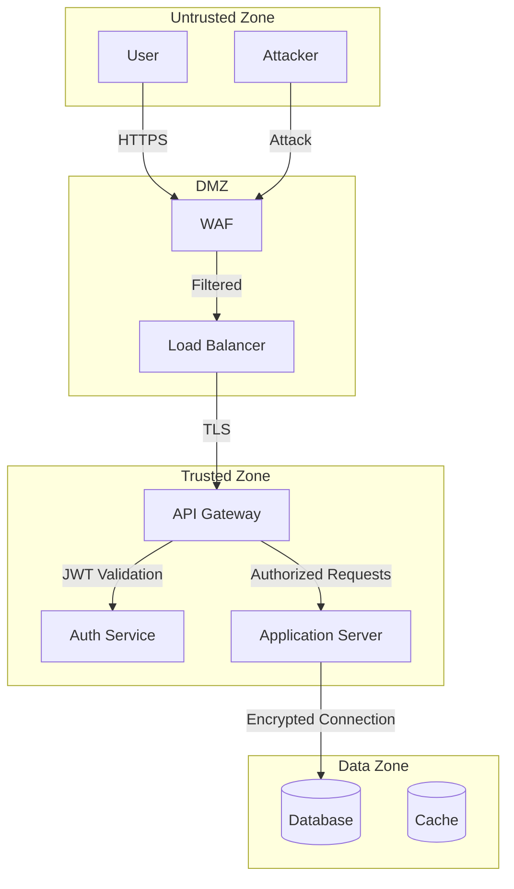
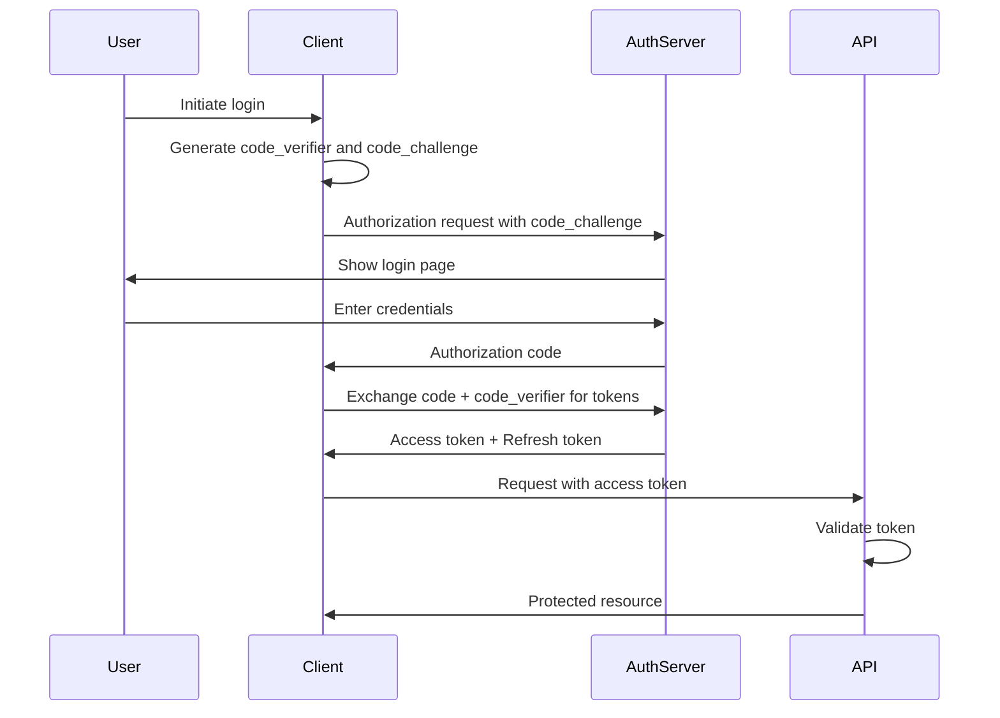
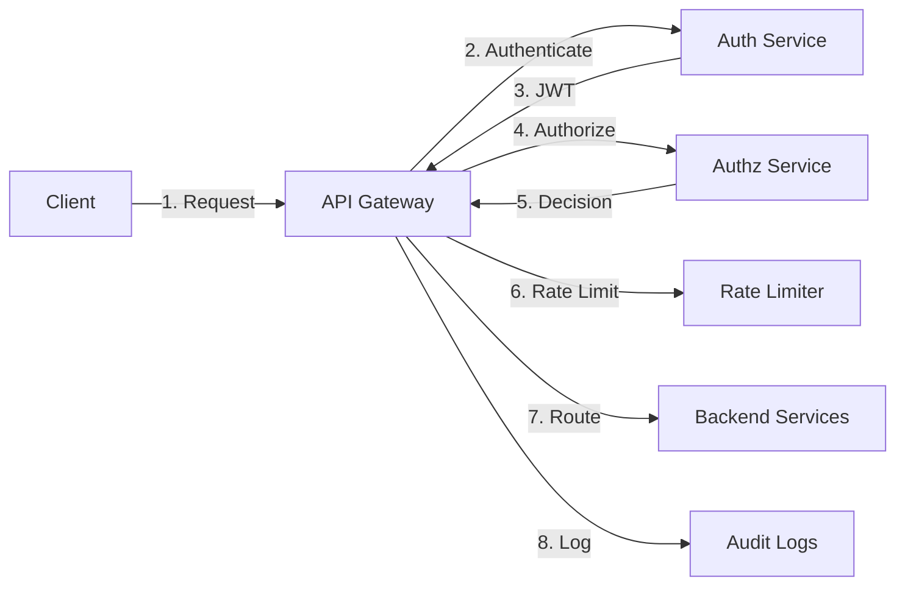
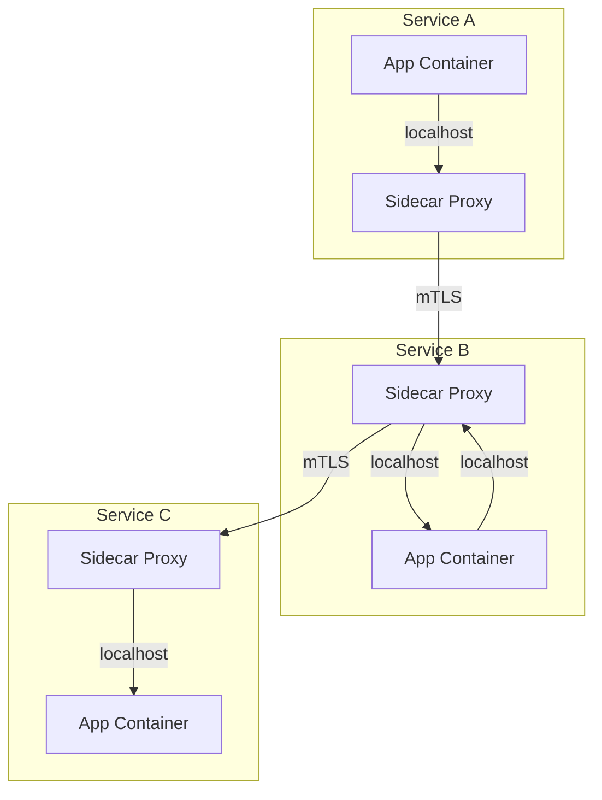

# Security Architecture Design

## Overview

This skill enables comprehensive security architecture design following zero-trust principles with defense-in-depth strategies. It covers threat modeling using STRIDE and DREAD methodologies, security control selection across preventive/detective/corrective categories, and complete authentication/authorization architecture planning including OAuth2, OIDC, RBAC, and ABAC patterns.

## Output Location

**IMPORTANT - Default Output Location**: Unless otherwise specified by the user, save all output files and data generated by this skill to `~/Documents/claude-code-skills-data/security-architecture-design/` directory. Create the directory if it doesn't exist. This ensures consistent organization across all skills.

## Workflow

Follow this sequential process for security architecture design:

### 1. Gather Requirements

**Collect system information:**
- Architecture diagrams and component descriptions
- Data flow diagrams showing information movement
- Threat landscape information (known threats, threat actors, compliance requirements)
- Business requirements (authentication needs, data sensitivity, user roles)
- Existing security controls and infrastructure
- Compliance frameworks (GDPR, SOC2, HIPAA, PCI-DSS)

**Ask clarifying questions if information is missing:**
- What are the main system components and their responsibilities?
- What types of data does the system handle (PII, PHI, financial)?
- What are the user roles and access requirements?
- What compliance frameworks must be followed?
- What existing security infrastructure is in place?
- What are known threats or previous security incidents?

### 2. Architecture Analysis

**Decompose the system:**
- Identify all components (frontend, backend, databases, APIs, third-party services)
- Map data flows between components
- Identify trust boundaries (where data crosses security domains)
- Document entry points (API endpoints, user interfaces, integrations)
- Identify assets requiring protection (data, services, credentials)

**Create architecture diagram:**
Use Mermaid diagram format to visualize the architecture with security zones:



### 3. Threat Modeling with STRIDE

Apply STRIDE methodology to each component and data flow. See [STRIDE.md](references/STRIDE.md) for complete methodology details.

**STRIDE Categories:**
- **S**poofing - Can an attacker impersonate users or systems?
- **T**ampering - Can data be modified in transit or at rest?
- **R**epudiation - Can users deny actions they performed?
- **I**nformation Disclosure - Can sensitive data be accessed by unauthorized parties?
- **D**enial of Service - Can the system be made unavailable?
- **E**levation of Privilege - Can users gain unauthorized access or permissions?

**For each component, ask:**
1. What STRIDE threats apply?
2. What are the attack vectors?
3. What security controls currently mitigate these threats?
4. What residual risk remains?

**Create threat table:**

| Component | STRIDE Category | Threat Description | Attack Vector | Current Controls | Residual Risk |
|-----------|----------------|-------------------|---------------|------------------|---------------|
| API Endpoint | Spoofing | Attacker impersonates legitimate user | Stolen credentials | Basic Auth | HIGH |
| Database | Information Disclosure | Unauthorized data access | SQL injection | Input validation | MEDIUM |
| Auth Service | Elevation of Privilege | Token manipulation | JWT tampering | Signature verification | LOW |

### 4. Risk Assessment with DREAD

Apply DREAD scoring to prioritize threats. See [DREAD.md](references/DREAD.md) for complete scoring methodology.

**DREAD Factors (each scored 0-10):**
- **D**amage - How severe is the impact if exploited?
- **R**eproducibility - How easy is it to reproduce the attack?
- **E**xploitability - How much skill/effort is required?
- **A**ffected Users - How many users are impacted?
- **D**iscoverability - How easy is it to find the vulnerability?

**Calculate risk score:** `Risk Score = (D + R + E + A + D) / 5`

**Risk scoring example:**

| Threat | Damage | Reproducibility | Exploitability | Affected Users | Discoverability | Risk Score | Priority |
|--------|--------|----------------|----------------|----------------|----------------|------------|----------|
| SQL Injection in login | 9 | 8 | 7 | 10 | 6 | 8.0 | CRITICAL |
| XSS in comments | 6 | 7 | 8 | 5 | 7 | 6.6 | HIGH |
| Missing rate limiting | 5 | 9 | 9 | 8 | 8 | 7.8 | HIGH |

**Prioritize threats:** Focus on CRITICAL (8.0+) and HIGH (6.0-7.9) risks first.

### 5. Security Control Selection

Design defense-in-depth strategy with multiple security layers. See [SECURITY_CONTROLS.md](references/SECURITY_CONTROLS.md) for comprehensive control catalog.

**Control Types:**
- **Preventive** - Stop attacks before they happen (authentication, authorization, input validation)
- **Detective** - Identify attacks in progress (logging, monitoring, IDS/IPS)
- **Corrective** - Respond to and recover from attacks (incident response, backup restoration)

**Defense-in-Depth Layers:**
1. **Perimeter Security** - WAF, DDoS protection, API gateway
2. **Network Security** - Network segmentation, firewalls, VPN
3. **Application Security** - Input validation, output encoding, CSRF tokens
4. **Data Security** - Encryption at rest, encryption in transit, data masking
5. **Identity & Access** - MFA, SSO, least privilege, RBAC
6. **Monitoring & Response** - SIEM, logging, alerting, incident response

**Create security control matrix:**

| Threat ID | Threat | Control Type | Control Name | Implementation | Status | Owner |
|-----------|--------|--------------|--------------|----------------|--------|-------|
| T-001 | SQL Injection | Preventive | Parameterized Queries | ORM with prepared statements | Complete | Backend Team |
| T-001 | SQL Injection | Detective | Query Monitoring | Log all database queries | In Progress | DevOps |
| T-002 | Credential Theft | Preventive | MFA | TOTP-based 2FA | Planned | Auth Team |

### 6. Authentication Architecture Design

Design authentication flows based on application type and requirements. See [AUTH_PATTERNS.md](references/AUTH_PATTERNS.md) for detailed patterns.

**Choose authentication mechanism:**

| Application Type | Recommended Pattern | Token Type | Flow |
|------------------|-------------------|------------|------|
| Web Application (server-rendered) | Session-based | Session cookies | Traditional login |
| Single Page App (SPA) | OAuth2 + PKCE | JWT (access + refresh) | Authorization code flow |
| Mobile App | OAuth2 + PKCE | JWT (access + refresh) | Authorization code flow |
| Server-to-Server | Client Credentials | JWT | OAuth2 client credentials |
| Microservices | Service Mesh + mTLS | JWT + mTLS | Zero-trust internal auth |

**Design authentication flow diagram:**

For OAuth2 Authorization Code Flow with PKCE (recommended for web/mobile):



**Authentication security requirements:**
- **Password policies** - Minimum 12 characters, complexity requirements, no common passwords
- **MFA requirement** - TOTP-based 2FA for all privileged accounts, optional for standard users
- **Session management** - 30-minute idle timeout, absolute 8-hour timeout, secure cookie flags
- **Token security** - Short-lived access tokens (15 minutes), long-lived refresh tokens (7 days), token rotation
- **Account lockout** - 5 failed attempts, 15-minute lockout, notify user via email

### 7. Authorization Architecture Design

Design authorization model based on access control requirements. See [AUTHZ_PATTERNS.md](references/AUTHZ_PATTERNS.md) for detailed patterns.

**Choose authorization model:**

| Model | Best For | Complexity | Flexibility |
|-------|----------|------------|-------------|
| **RBAC (Role-Based)** | Fixed roles with consistent permissions | Low | Medium |
| **ABAC (Attribute-Based)** | Dynamic policies based on context | High | High |
| **ReBAC (Relationship-Based)** | Social networks, document sharing | Medium | Medium |
| **PBAC (Policy-Based)** | Complex enterprise requirements | High | Very High |

**RBAC Design Example:**

```
Roles Hierarchy:
- Admin (all permissions)
  └── Manager (read/write own team)
      └── User (read/write own data)
          └── Guest (read public data)

Permissions:
- users:read
- users:write
- users:delete
- documents:read
- documents:write
- documents:delete
- reports:read
- reports:generate

Role Assignments:
Admin: users:*, documents:*, reports:*
Manager: users:read, documents:*, reports:*
User: documents:read, documents:write (own), reports:read
Guest: documents:read (public)
```

**Authorization enforcement:**
- Centralized authorization service (separate from authentication)
- Policy enforcement at API gateway level
- Additional enforcement at application level (defense in depth)
- Audit logging for all authorization decisions
- Regular access reviews for role assignments

### 8. API Security Architecture

Design secure API architecture with gateway pattern. See [API_SECURITY.md](references/API_SECURITY.md) for detailed patterns.

**API Gateway Pattern:**



**API Security Controls:**
- **Authentication** - JWT validation at gateway, reject unauthenticated requests
- **Authorization** - Policy-based access control, scope validation
- **Rate Limiting** - Per-user (100 req/min), per-IP (1000 req/min), per-endpoint limits
- **Input Validation** - JSON schema validation, request size limits (10MB max)
- **Output Filtering** - Remove sensitive fields, apply data masking
- **CORS Policy** - Whitelist allowed origins, restrict methods
- **API Versioning** - URL-based versioning (v1, v2), deprecation policy
- **Request Signing** - HMAC signatures for sensitive operations
- **TLS Enforcement** - TLS 1.3 only, strong cipher suites, HSTS headers

**API Security Headers:**
```
Strict-Transport-Security: max-age=31536000; includeSubDomains
X-Content-Type-Options: nosniff
X-Frame-Options: DENY
X-XSS-Protection: 1; mode=block
Content-Security-Policy: default-src 'self'
```

### 9. Microservices Security Architecture

Design zero-trust security for microservices communication. See [MICROSERVICES_SECURITY.md](references/MICROSERVICES_SECURITY.md) for detailed patterns.

**Zero-Trust Principles for Microservices:**
- Never trust, always verify (authenticate every request)
- Least privilege access (service-specific permissions)
- Assume breach (limit blast radius with network segmentation)
- Encrypt everything (TLS for all internal communication)
- Monitor and log all access (complete audit trail)

**Service Mesh Pattern with mTLS:**



**Microservices Security Controls:**
- **mTLS (mutual TLS)** - Both client and server authenticate with certificates
- **Service Identity** - Each service has unique identity (SPIFFE/SPIRE)
- **Certificate Management** - Automatic certificate rotation (short-lived certs)
- **Network Policies** - Explicitly allow/deny service-to-service communication
- **Service Authorization** - JWT with service scopes, OPA policy enforcement
- **Distributed Tracing** - Correlation IDs for security event investigation
- **Circuit Breakers** - Prevent cascading failures from security events

### 10. Documentation and Deliverables

Create comprehensive security architecture documentation with all design decisions and rationale.

**Deliverable 1: Security Architecture Document** (`security_architecture.md`)

Structure:
```markdown
# Security Architecture Document

## Executive Summary
- System overview
- Security posture summary
- Key security controls
- Compliance status

## Architecture Overview
- System architecture diagram with security zones
- Component descriptions
- Trust boundaries
- Data flow diagrams

## Zero-Trust Design
- Zero-trust principles applied
- Identity verification approach
- Network segmentation strategy
- Continuous monitoring plan

## Authentication Architecture
- Authentication mechanism (OAuth2, OIDC, etc.)
- Authentication flow diagram
- Token management strategy
- MFA implementation
- Session management

## Authorization Architecture
- Authorization model (RBAC, ABAC, etc.)
- Role/permission definitions
- Policy enforcement points
- Access control matrix

## API Security Architecture
- API gateway design
- Rate limiting strategy
- Input validation approach
- API security controls

## Microservices Security
- Service-to-service authentication (mTLS)
- Service authorization
- Network policies
- Certificate management

## Security Controls Matrix
[Table mapping threats to controls]

## Compliance Mapping
[Map controls to compliance requirements]

## Implementation Roadmap
- Phase 1: Critical controls
- Phase 2: High-priority controls
- Phase 3: Medium-priority controls
```

**Deliverable 2: Threat Model Document** (`threat_model.md`)

Structure:
```markdown
# Threat Model

## Threat Modeling Methodology
- STRIDE methodology applied
- DREAD risk scoring used
- Scope and assumptions

## System Decomposition
- Components analyzed
- Trust boundaries identified
- Entry points documented

## Threat Identification (STRIDE)
### Component: API Gateway
**Spoofing Threats:**
- [Threat details, attack vector, controls]

**Tampering Threats:**
- [Threat details, attack vector, controls]

[Continue for all STRIDE categories]

## Risk Assessment (DREAD)
[Risk scoring table with all threats]

## Threat Mitigation Strategies
[For each high/critical threat, detailed mitigation]

## Residual Risk Assessment
[After controls, what risk remains]

## Attack Trees
[Visual representation of attack paths]
```

**Deliverable 3: Security Controls Matrix** (`security_controls_matrix.md`)

Create a comprehensive table:

| Threat ID | Threat Description | STRIDE Category | DREAD Score | Control Type | Control Name | Implementation Details | Status | Owner | Target Date |
|-----------|-------------------|----------------|-------------|--------------|--------------|----------------------|--------|-------|-------------|
| T-001 | SQL Injection in user input | Tampering | 8.0 | Preventive | Parameterized Queries | Use ORM with prepared statements | Complete | Backend | - |
| T-002 | Credential stuffing attacks | Spoofing | 7.5 | Preventive | MFA | TOTP-based 2FA | Planned | Auth Team | Q2 2024 |

### 11. Review and Validation

Before finalizing the security architecture, perform validation checks:

**Validation Checklist:**
- [ ] All system components have documented security controls
- [ ] All trust boundaries are explicitly marked and protected
- [ ] Threat model covers all STRIDE categories for each component
- [ ] DREAD risk scores justify control selection
- [ ] Architecture supports principle of least privilege
- [ ] Defense-in-depth with at least 3 security layers
- [ ] Authentication supports MFA capability
- [ ] Authorization model matches business requirements
- [ ] API security includes rate limiting and input validation
- [ ] Microservices use mTLS for internal communication
- [ ] All compliance requirements mapped to controls
- [ ] Implementation roadmap includes resource estimates
- [ ] Diagrams use standard security notation
- [ ] Documentation includes rationale for design decisions
- [ ] Residual risks are documented and accepted

**If any checklist item is unchecked, revise the architecture before finalizing.**

## Quality Standards

Every security architecture design must meet these standards:

**Completeness:**
- Every component analyzed for security threats
- All STRIDE categories considered
- All trust boundaries documented
- All data flows mapped

**Risk Management:**
- All threats scored with DREAD methodology
- Risk scores justify control selection and priority
- Residual risks explicitly documented
- High/critical risks have detailed mitigation plans

**Zero-Trust Alignment:**
- "Never trust, always verify" principle applied
- Identity-based access control (not network-based)
- Continuous verification of all requests
- Least privilege access enforced

**Defense-in-Depth:**
- Minimum 3 security layers for critical assets
- Mix of preventive, detective, and corrective controls
- No single point of failure
- Redundant controls for high-value assets

**Authentication/Authorization:**
- Modern authentication patterns (OAuth2/OIDC)
- MFA capability included
- Authorization model matches business needs
- Token security best practices followed

**Documentation Quality:**
- Clear, concise technical writing
- Diagrams follow standard notation
- All design decisions have documented rationale
- Implementation guidance is actionable

## Reference Files

This skill includes comprehensive reference documentation:

- **[STRIDE.md](references/STRIDE.md)** - Complete STRIDE threat modeling methodology with examples
- **[DREAD.md](references/DREAD.md)** - DREAD risk scoring methodology with scoring guidelines
- **[SECURITY_CONTROLS.md](references/SECURITY_CONTROLS.md)** - Comprehensive catalog of security controls
- **[AUTH_PATTERNS.md](references/AUTH_PATTERNS.md)** - Authentication architecture patterns (OAuth2, OIDC, SAML, JWT)
- **[AUTHZ_PATTERNS.md](references/AUTHZ_PATTERNS.md)** - Authorization architecture patterns (RBAC, ABAC, ReBAC, PBAC)
- **[API_SECURITY.md](references/API_SECURITY.md)** - API security architecture patterns and best practices
- **[MICROSERVICES_SECURITY.md](references/MICROSERVICES_SECURITY.md)** - Microservices security patterns with zero-trust design
- **[COMPLIANCE_MAPPING.md](references/COMPLIANCE_MAPPING.md)** - Mapping security controls to compliance frameworks

Refer to these files for detailed implementation guidance and patterns.

## Common Patterns and Examples

**Pattern 1: Web Application with Database**
- WAF for perimeter security
- OAuth2 + PKCE for authentication
- RBAC for authorization
- API gateway with rate limiting
- TLS for all connections
- Encrypted database with column-level encryption for PII

**Pattern 2: Microservices Architecture**
- Service mesh with mTLS for internal communication
- API gateway for external traffic
- JWT with service scopes for authorization
- Zero-trust network policies
- Distributed tracing for security monitoring
- Centralized logging with SIEM

**Pattern 3: Mobile App with Backend API**
- OAuth2 authorization code flow with PKCE
- Short-lived access tokens (15 min)
- Refresh token rotation
- Certificate pinning in mobile app
- API rate limiting per user
- Biometric authentication on device

**Pattern 4: Third-Party API Integration**
- API key authentication with rotation
- Request signing with HMAC
- IP whitelisting
- Rate limiting
- Request/response validation
- Audit logging of all API calls
